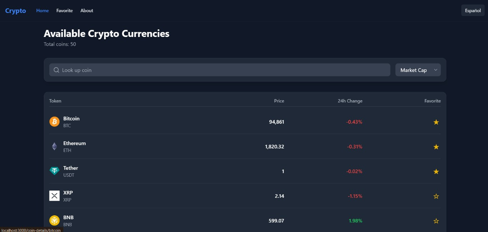
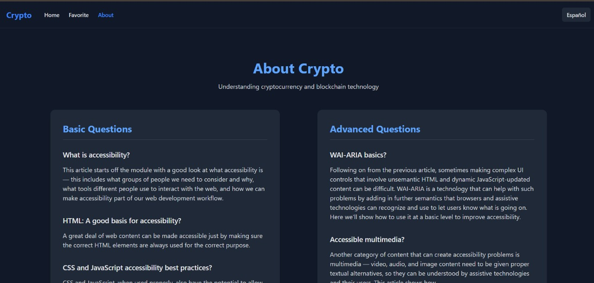
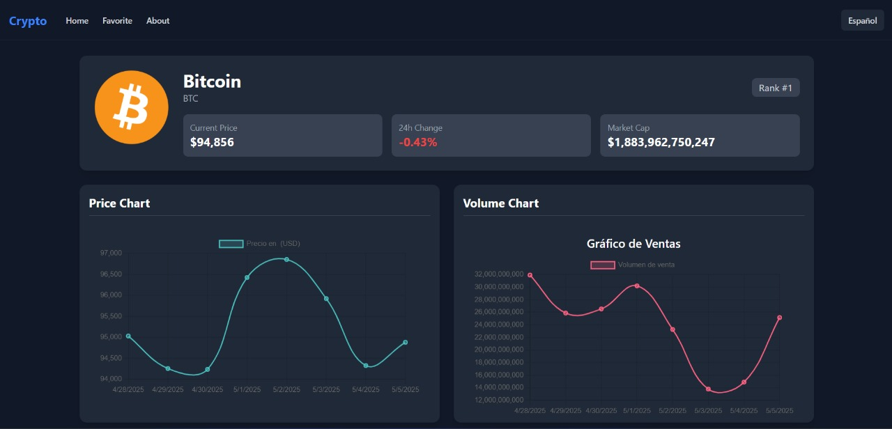

# Crypto - TP2 PWA

Crypto es una aplicación web desarrollada como parte del Trabajo Práctico 2 (TP2) de la materia **Programación Web Avanzada (PWA)**. Este proyecto está diseñado para explorar el mundo de las criptomonedas, ofreciendo una experiencia intuitiva y visualmente atractiva para consultar las 50 principales criptomonedas. Además, los usuarios pueden acceder a información detallada de cada moneda al hacer clic en su tarjeta.

---

## 📸 Vista previa del proyecto

<div align="center">
  
  
  <br />
  
  
</div>

---

## 📜 Trabajo Practico 2 

**Miembros del Grupo:**
- Gabriela Contreras (fai-4480)
- Katherine Contreras (fau 4696)


**Materia:** Programación Web Avanzada  
**Profesor:** Agustin Chiarotto  
**Año:** 2025  
**Repositorio:** (https://github.com/Gabriela-contreras/coingecko-react-tailwindcss-Crypto/)

---

## 🚀 Tecnologías Utilizadas

Este proyecto se desarrolló utilizando las siguientes herramientas y tecnologías:

- **React:** Biblioteca para construir interfaces de usuario. [Documentación](https://reactjs.org/)
- **Tailwind CSS:** Framework de utilidades para estilos rápidos y consistentes. [Documentación](https://tailwindcss.com/)
- **Framer Motion:** Biblioteca para crear efectos. [Documentación](https://motion.dev/)
- **chart.js:** Biblioteca para crear Graficos. [Documentación](https://www.chartjs.org/)
- **React Router Dom:** Gestión de rutas en aplicaciones React. [Documentación](https://reactrouter.com/)
- **react i18next:** Framework para traducir a distintos idioma. [Documentación](https://react.i18next.com/)
- **CoinGecko API:** Fuente de datos en tiempo real sobre criptomonedas. [Documentación](https://www.coingecko.com/en/api)

---

## 🌐 Recursos del Proyecto

- **APIs utilizadas:**
  - Obtener las 50 principales criptomonedas:  
    `https://api.coingecko.com/api/v3/coins/markets?vs_currency=usd&order=market_cap_desc&per_page=50&page=1&sparkline=false`
  - Obtener detalles de una moneda por ID:  
    `https://api.coingecko.com/api/v3/coins/{id}`

---

## 📌 Funcionalidades

La aplicación Crypto permite a los usuarios:

- **Navegar por una lista** de las criptomonedas más populares.
- **Visualizar información detallada** como precio actual, capitalización de mercado y más.
- **Marcar monedas como favoritas** para un acceso rápido.
- **Ver gráficos simples** sobre tendencias de precios.

---
## 🖼️ Imagnes del proyecto 


## 🛠️ Guía de Instalación

Sigue estos pasos para instalar y ejecutar el proyecto localmente:

1. **Clonar el repositorio:**
   ```bash
   git clone https://github.com/usuario/repo.git
   ```

2. **Navegar al directorio del proyecto:**
   ```bash
   cd repo
   ```

3. **Instalar dependencias:**
   ```bash
   npm install
   ```

4. **Ejecutar la aplicación en modo desarrollo:**
   ```bash
   npm start
   ```

5. **Abrir la aplicación en el navegador:**
   La aplicación estará disponible en `http://localhost:3000`.

---

## 🌟 Despliegue

El proyecto está desplegado en [Vercel](https://coingecko-react-tailwindcss-crypto.vercel.app/). 

---


## 🤝 Contribuciones

¡Contribuciones, issues y sugerencias son bienvenidas! Por favor, sigue estos pasos:

1. Haz un fork del proyecto.
2. Crea una nueva rama (`git checkout -b feature/nueva-funcionalidad`).
3. Realiza los cambios y haz un commit (`git commit -m 'Añadir nueva funcionalidad'`).
4. Envía un pull request.

---
